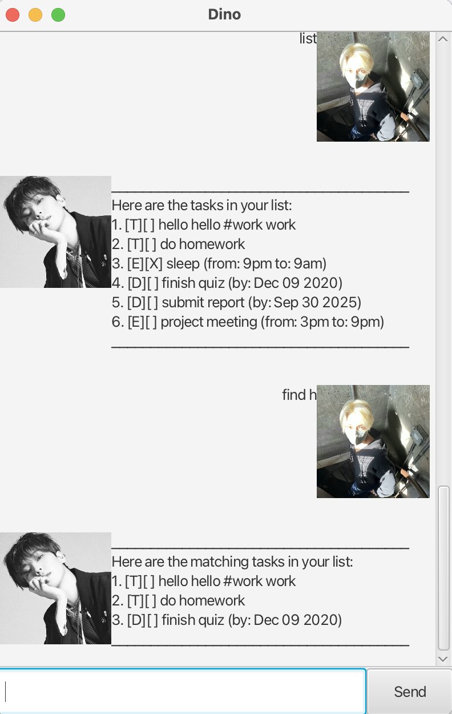

# Dino User Guide




Dino is a task management chatbot that helps you keep track of your tasks such as todos, deadlines, and events. It provides a simple command-based interface for you to add, list, and manage tasks efficiently.

## Quick Command Reference

| Command | Purpose | Format |
|---------|---------|--------|
| `todo` | Add a todo task | `todo <DESCRIPTION>` |
| `deadline` | Add a task with deadline | `deadline <DESCRIPTION> /by <yyyy-MM-dd>` |
| `event` | Add a task with start/end time | `event <DESCRIPTION> /from <START_TIME> /to <END_TIME>` |
| `list` | Show all tasks | `list` |
| `mark` | Mark a task as done | `mark <TASK_INDEX>` |
| `unmark` | Mark a task as not done | `unmark <TASK_INDEX>` |
| `tag` | Add a tag to a task | `tag <TASK_INDEX> <TAG_NAME>` |
| `delete` | Remove a task | `delete <TASK_INDEX>` |
| `find` | Search tasks by keyword | `find <KEYWORD>` |
| `bye` | Exit Dino | `bye` |

## Adding todos

Adds a simple task with only a description.

**Format:** `todo <DESCRIPTION>`

Example: `todo read book`

Expected outcome:

```
Got it. I've added this task:
[T][ ] read book
Now you have 1 task in the list.
```

## Adding deadlines

Adds a task with a description and a deadline date.

**Format:** `deadline <DESCRIPTION> /by <yyyy-MM-dd>`

Example: `deadline submit report /by 2025-09-30`

Expected outcome:

```
Got it. I've added this task:
[D][ ] submit report (by: Sep 30 2025)
Now you have 2 tasks in the list.
```

## Adding events

Adds a task with a description, start time, and end time.

**Format:**  `event <DESCRIPTION> /from <START_TIME> /to <END_TIME>`

Example: `event project meeting /from 3pm /to 9pm`

Expected outcome:

```
Got it. I've added this task:
[E][ ] project meeting (from: 3pm to: 9pm)
Now you have 3 tasks in the list.
```

## Listing all tasks

Shows all tasks currently saved.

**Format:** `list`

Example: `list`

Expected outcome:

```
Here are the tasks in your list:
1.[T][ ] read book
2.[D][ ] submit report (by: Sep 30 2025)
3.[E][ ] project meeting (from: 3pm to: 9pm)
```

## Marking tasks as done

Marks a specified task as completed.

**Format:** `mark <TASK_INDEX>`

Example: `mark 2`

Expected outcome:

```
Nice! I've marked this task as done:
[D][X] submit report (by: Sep 30 2025)
```

## Unmarking tasks

Marks a completed task as not done.

**Format:** `unmark <TASK_INDEX>`

Example: `unmark 2`

Expected outcome:

```
OK, I've marked this task as not done yet:
[D][ ] submit report (by: Sep 30 2025)
```

## Add tag to task

Add tags to the task.

**Format:** `tag <TASK_INDEX> <TAG_NAME>`

Example: `tag 3 fun`

Expected outcome:

```
Tagged task: [E][ ] project meeting #fun (from: 3pm to: 9pm)
```
## Deleting tasks

Removes a specified task from the list.

**Format:** `delete <TASK_INDEX>`

Example: `delete 1`

Expected outcome:

```
Noted. I've removed this task:
[T][ ] read book
Now you have 2 tasks in the list.
```

## Finding tasks by keyword

Searches tasks containing a given keyword.

**Format:** `find <KEYWORD>`

Example: `find report`

Expected outcome:

```
Here are the matching tasks in your list:
1.[D][ ] submit report (by: Sep 30 2025)
```


## Exiting Dino

Closes the program.

**Format:** `bye`

Example: `bye`

Expected outcome:

```
Bye. Hope to see you again soon!
```
